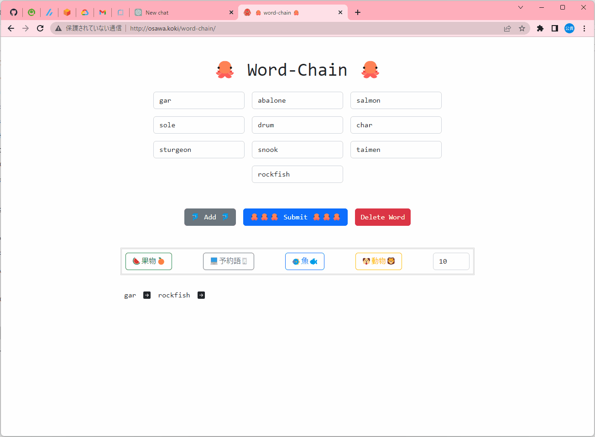

# word-chain.py

Pythonで最長しりとりを探してみる。  

  

## 環境情報

| 機能 | バージョン |
| ---- | ---- |
| Windows | 11 Home |
| Python | 3.11 |

## 実行方法

```shell
uvicorn main:app
```

Dockerを使用すると、、、  

```shell
docker build -t word-chain-py . && docker run -it --rm -p 80:80 --name my-word-chain-py word-chain-py
```
